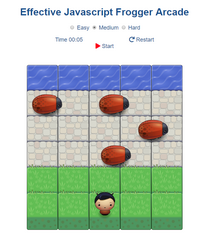
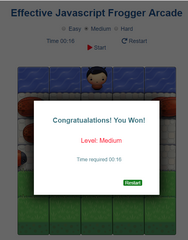

# Effective Javascript Frogger Arcade

## Table of Contents

* [Installation](#Installation)
* [Instructions](#instructions)
* [Level Customization](#customization)
* [Project Reference Sources Or Links](#references)

## Installation

The game runs on any browser or mobile devices. You can just click on the `index.html` file and play. If you choose to install it on the web server. You can
create a folder (for example `Game`) and copy the folder `css` , `images` , `js` and the file `index.html` and paste it inside the `Game` folder. Copy the `Game` folder to the root directory of the web server. Inorder to access the web site for example `localhost`: you just need to type in `http://localhost/Game/index.html`.

## Instructions

In this game you have a Player and Enemies (bugs). The goal of the player is to reach the water, without colliding into any one of the enemies.

To get started, clck the `Play` button. The timer will start automatically. To `Restart` click the clockwise `arrow` button.

* Move the player left, right, up and down with the arrows keys on the
  keyboard.
* Once a the player collides with an enemy, the game is reset and the player    moves back to the starting square.
* Once the player reaches the water (i.e., the top of the game board), the      game is won. A modal will be showing out and display the summary. If you
  want to continue click the "Restart" button.
* You have three options to set the levels of difficulty of the game.           "Easy", "Medium" and "Hard". Each levels is base on the speed of the bugs,    the no of      the bugs. Try It Out! 
* To customize each levels base on your choice. You can customize the           variables in the coding. NOTE: This is only for advance user with the         knowledge of   javascript programming.

## Customization

For this part, this is only for advance user with the knowledge of javascript programming. We will customize the "Easy" Level for demostration. Each Level applies the same.

The only file you need to modify is "**app.js**". The function you need to modify
is **gameSetUp()**.

Below lists the variables and their use.

* noOfBugs - This is the number of Bug(s) you want for the game. For example:   for the "Easy" level. I want the total number of Bug(s) is 4. That means      the  game will dispatch 4 Bugs at the same time.
* treshold - The treshold variable is a number that multiplies to the distance     of the bug (which is -101 off the screen) at the beginning. You can think of the distance     between each bug at    the beginning time. As the treshold number increases the   distance between     each bugs increases. Lets modify the treshold number     to 5.
* speedMax - This is the maximun speed of the bug crossing through. As the number increases the speed also increases.
* speedMin - This is the minimun speed of the bug crossing through. Why we need the minimun speed? This is because a random number will be generated for the bug between the maximun speed and the minimun speed. Therefore each bug will have a random speed that base on the maximun and minimun value. Some bugs will move faster and some bugs will move slower (each is base on the random number generated). The interesting part is as the differences of the maximun and the minimun speed shorten, the speed of all bugs maintain a stable speed (either fast or slow). As the difference is largely further  apart, the speed of each bugs will be moving either very fast or very slow. For the "Easy" level, lets set the maximun value to 600 and the minimun value to 400.
* yaxes - This is an array. This **MUST BE CORRESPONT** to the "noOfBugs". For the "Easy" level we set the noOfBugs to 4, therefore the "yaxes" array SHOULD HAVE the total of 4 Items. The Items must be contain the following values:
    * firstRow
    * secondRow
    * thirdRow

    As the name describe the value will be the bugs position. For example if there are 4 bugs you want to set the number of bug(s) for the first row is 2. For the second row you want it to be 1, and the third row  is 1. Then the array will be:

    `yaxes = [firstRow, secondRow, thirdRow, firstRow];`

    There is no order preferences, you can order the item anyway you like.

## References

* fonts or incons
    * [Font Awesome](https://fontawesome.com/?from=io)
* Code References
    * [CSS Tricks](https://css-tricks.com)
    * [Stack OverFlow](https://stackoverflow.com/)
    * [w3schools](https://www.w3schools.com)
    * [Udacity](https://www.udacity.com/)
    * [GitHub](https://github.com/)
    * [Collision Detection](https://stackoverflow.com/questions/13916966/adding-collision-detection-to-images-drawn-on-canvas)
    